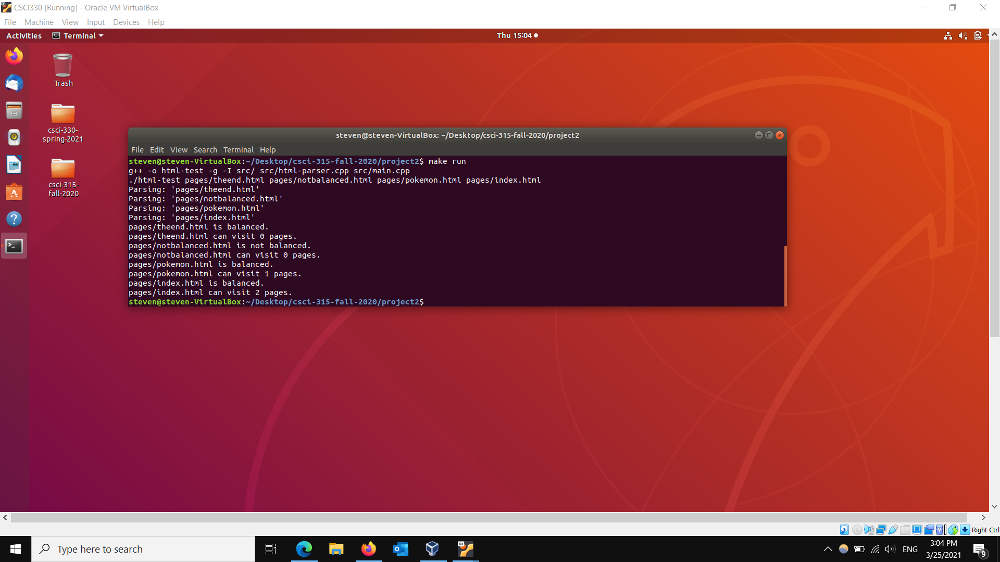

Portfolio
=========

Programming Projects
--------------------

*For access to my private project repositories, please [email me](mailto:say@csustudent.net?subject=GitHub%20Access) with the subject line, GitHub Access.

---
### [HTML Web Crawler | CSCI 315](project1)

---
### [RPG Team Project | CSCI 325](https://github.com/csu-cs/RPG-team-project)

---
### [League Multiplayer Project | CSCI 332](https://github.com/yeungs2019/League)

---
### [Project 4 Title | CSCI 332]

---

Ethics Papers
-------------

### [Therac-25 and Ethical Testing](/pdf/ethics.pdf)

-   Class: CSCI 315 
-   Grade: 95

### [Copyright and Ethical Rights](/pdf/EthicsPaper-converted.pdf)
-   Class: CSCI 301 
-   Grade: 97

### [Program Creation and Storage](/pdf/EthicPaper.pdf)

-   Class: CSCI 325
-   Grade: 100

---

Presentations
-------------

### [Ticketmaster Security Breach](/pdf/Sec.pdf)

- Class: CSCI 301
- Grade: 100

### [6x64 Decoder (Single Cycle Processor)](/pdf/6x64decoder.pdf)

- Class: CSCI 330
- Grade: 100

---

Page template forked from <a href="https://github.com/csu-cs/csci-portfolio">CSU-CS</a>

<!-- Remove above link if you don't want to attributive -->
