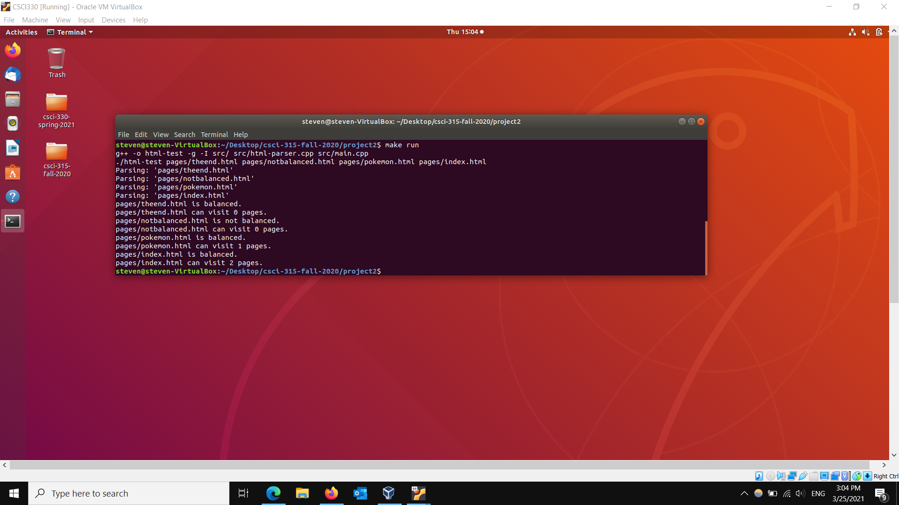

[Back to Portfolio](./)

HTML Web Crawler
===============

-   **Class: CSCI 315** 
-   **Grade: 100**
-   **Language(s): C++**
-   **Source Code Repository:** [yeungs2019WebCrawler](https://github.com/yeungs2019/csci-315-fall-2020/tree/master/project2)  
    (Please [email me](mailto:sayeung@csustudent.net?subject=GitHub%20Access) to request access.)

## Project description

This data structure project involved the uses of one or more data structures in order to parse through several HTML pages. The project had a total of three functions:
* Checks if HTML page is balanced
    * This function will determine if the HTML tags are balanced or not
* Parsing through the HTML page
    * This function reads the HTML page and parses through it.
* Determines how many pages a HTML page can visit.
    * This function calls the balanced function and if true, determines how many pages a singular HTML page can visit.


## How to compiles / run the program

How to compile (if applicable) and run the project.

```bash
cd project2
g++ -o html-test -g -I src/ src/html-parser.cpp src/main.cpp
```

## UI Design

This project is not an User Interface Project.  It mainly ran on a terminal in linux, therefore, the UI design of this project is quite simple.  When the program is ran, it will display if the HTML page(s) are balanced or not.  It will also display how many pages the HTML page can visit. The balance function uses vector of strings and integers in order to determine if the HTML pages are balanced or not. The parse function uses a vector of strings to parse and read through the HTML page.  Finally, the pages visiting function is a recursive function that uses a vector of strings and integers to determine if a HTML page is able to visit to any other pages or not.


Fig 1. The results when given various HTML pages

## 3. Additional Considerations

This project was created as review of data structures that are useful in day to day coding environments.

For more details see [GitHub Flavored Markdown](https://guides.github.com/features/mastering-markdown/).

[Back to Portfolio](./)
