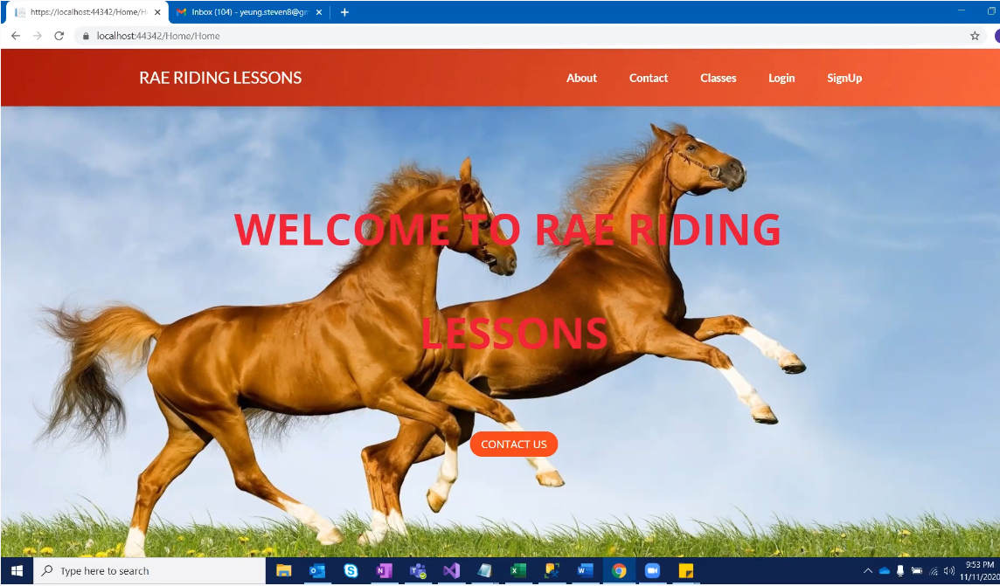
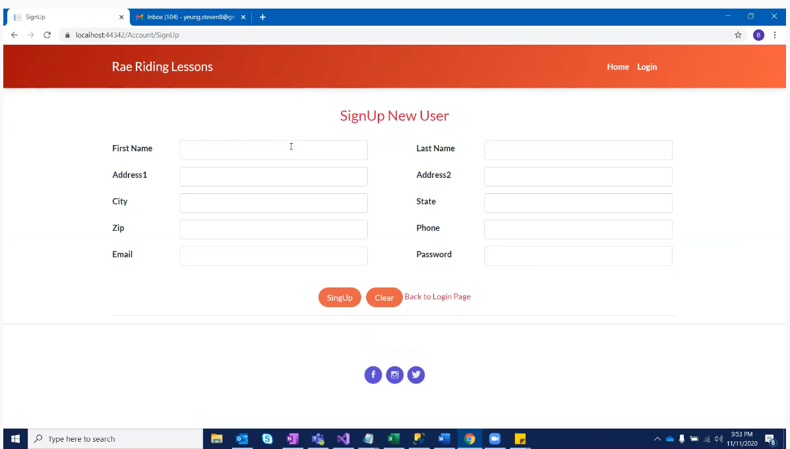
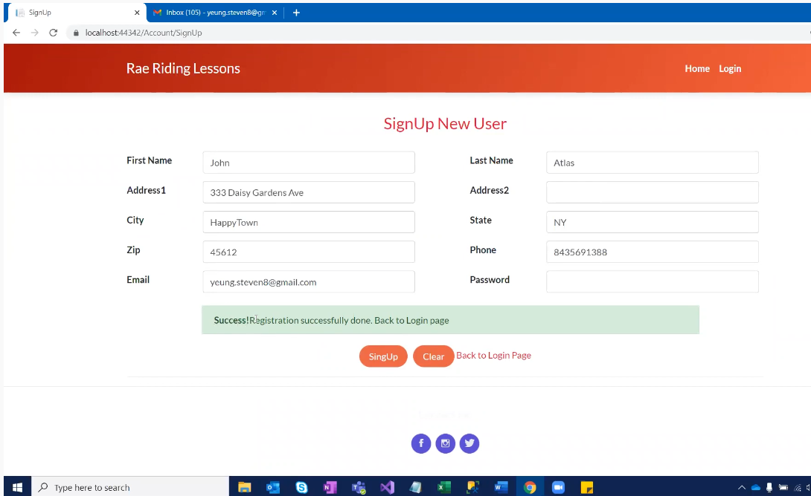
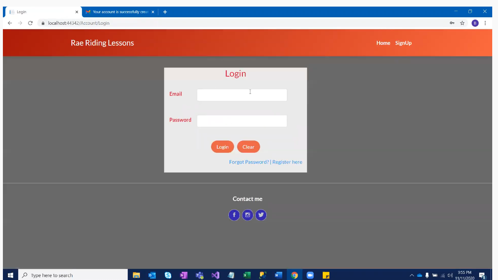
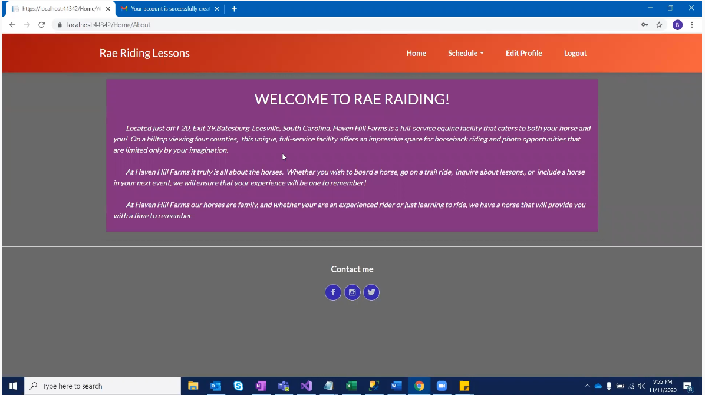
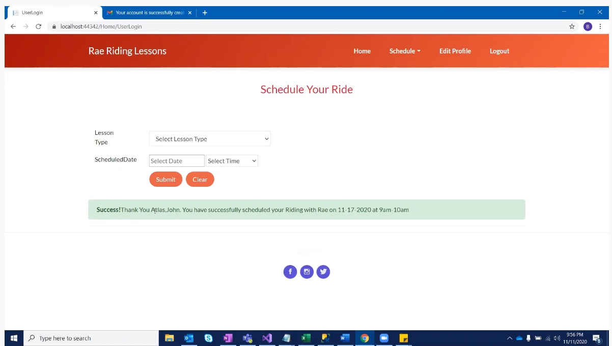
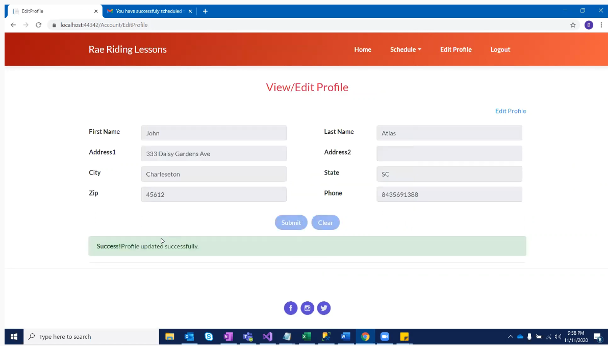

[Back to Portfolio](./)

Rae Riding Lesson
===============

-   **Class: CSCI 495** 
-   **Grade: 100**
-   **Language(s): T SQL, HTML, CSS**
-   **Source Code Repository:** [yeungs2019RidingLesson](https://github.com/Epowell50/CSCI-495-Team-Project)  
    (Please [email me](mailto:sayeung@csustudent.net?subject=GitHub%20Access) to request access.)

## Project description
This team project was required in fulfillment of CSCI 495.  It involved designing a website allowing a user to create an account to sign up for horse back riding lessons.  This project was started in order to expand a company that is giving horse back riding lessons.  With the creation of this website, it made it easier for the company to keep track of all of its clients.  By creating a website and implementing a database, it was more effective in accessing schedule times and dates.  It involved the teamwork of four people.  These people included Vijay Perumal, Ethan Powell, Lindsay Freshour, and Steven Yeung.  Multiple people were needed to code the webstie, make it appealing for the user , and promote efficiency.


## How to compile / run the program

How to compile (if applicable) and run the project.

```bash
This was a localized project.
1. Download Visual Basic 
2. Download SQL and T SQL
3. Download the GitHub Repository Contents into one folder
4. Click Run.
```

## UI Design

This project focused heavily on UI design because it involved designing a website for clients who desire horseback riding lessons.  When starting up the website (See Fig.1), the user will be greeted by the home page of the website.  If the user does not have an account, he/she will be able to create one by clicking the SignUp button on the top right hand corner.  Otherwise, they would click Login.  Once the user clicks SignUp (See Fig.2), the user is prompted to fill in personal information.  Once the information is filled in, the user will then be asked to confirm their account by visiting their email (See Fig.3).  Once their account is confirmed, they are prompted to a login page (See Fig.4) and are now allowed to sign up for horse back riding lessons.  Once logged in, they are greeted with a home page similar to Fig.1 (See Fig.5). Once there, they will be able to sign up for horse back riding lessons by clicking the schedule dropdown banner.  Here, they will be directed a page where they will be able to pick the type of lesson and when it will be held (See Fig.6).  If the user is unable to attend that date and/or time he/she has selected.  The user is able to update their time to another (See Fig. 7).  Once the user has updated thier time, fig. 6 will be updated alongside it. The user will also have the ability to update their personal information if they have previously made an error (See Fig. 8)


Fig 1. The first page that will be seen when the program is first run


Fig 2. The page when user clicks signup


Fig 3 After sign up is successful, the user will be asked to confirm.


Fig 4. The login page


Fig 5. After login is successful, the user is greeted with message


Fig 6. The user scheduling his/her appointment


Fig 7. The user's ability to reschedule


Fig 8. The user's ability to change personal information

## 3. Additional Considerations
This project gave a view of what it is actually like in the real workplace.  Deadlines had to be made.  Communication was a key factor for success. It was an extensive team project that took time to develop.  Credit to those involved in the large team project.

For more details see [GitHub Flavored Markdown](https://guides.github.com/features/mastering-markdown/).

[Back to Portfolio](./)
