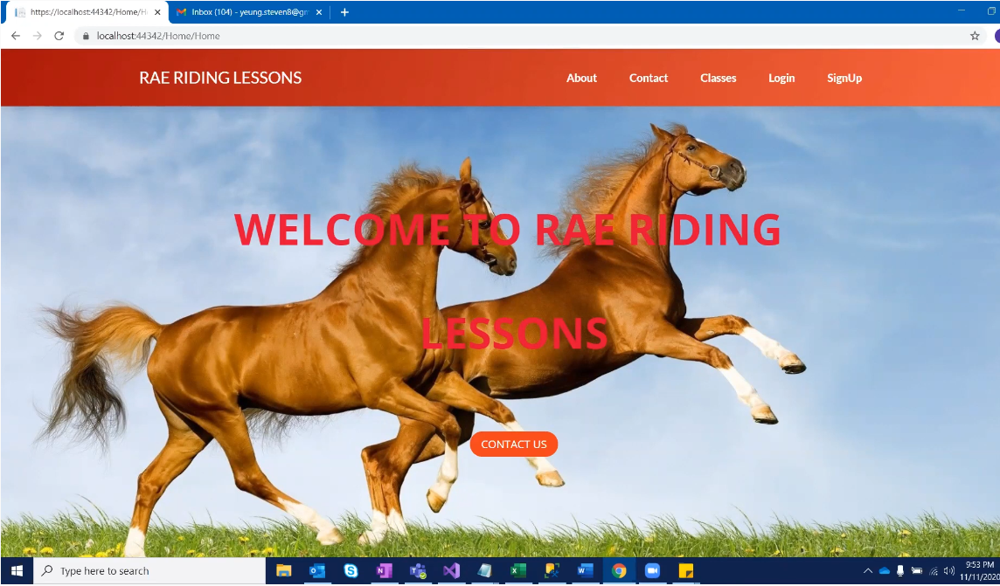

[Back to Portfolio](./)

Role Playing Game
===============

-   **Class: CSCI 325** 
-   **Grade: 100**
-   **Language(s): Java**
-   **Source Code Repository:** [yeungs2019RPG](https://github.com/Epowell50/CSCI-495-Team-Project)  
    (Please [email me](mailto:sayeung@csustudent.net?subject=GitHub%20Access) to request access.)

## Project description
This project was required for the completion of CSCI 325.  It was a very large project that required the assistance of three people. Each person was assigned to a portion of the program.  I was assigned to design and implement the items in the game.  There are a total of three items, which one of the healed, and the other two hurt.  There were puzzles, which were the main portion of the project.  Each time a puzzle was completed, the player is granted 25 points. Once a player reached 100 points, the game is over and the player has won.

## How to compile / run the program

How to compile (if applicable) and run the project.

```bash
This was a localized project.  All you need is to download the repository and have Visual Studio to run.
No commands were necessary to run the program.
```

## UI Design

This project focused heavily on UI design because it involved designing a website for clients who desire horseback riding lessons.  When starting up the website (See Fig.1), the user will be greeted by the home page of the website.  If the user does not have an account, he/she will be able to create one by clicking the SignUp button on the top right hand corner.  Otherwise, they would click Login.  Once the user clicks SignUp (See Fig.2), the user is prompted to fill in personal information.  Once the information is filled in, the user will then be asked to confirm their account by visiting their email (See Fig.3).  Once their account is confirmed, they are prompted to a login page (See Fig.4) and are now allowed to sign up for horse back riding lessons.  Once logged in, they are greeted with a home page similar to Fig.1 (See Fig.5). Once there, they will be able to sign up for horse back riding lessons by clicking the schedule dropdown banner.  Here, they will be directed a page where they will be able to pick the type of lesson and when it will be held (See Fig.6).  If the user is unable to attend that date and/or time he/she has selected.  The user is able to update their time to another (See Fig. 7).  Once the user has updated thier time, fig. 6 will be updated alongside it. The user will also have the ability to update their personal information if they have previously made an error (See Fig. 8)


Fig 1. The first page that will be seen when the program is first run


Fig 2. The page when user clicks signup


Fig 3 After sign up is successful, the user will be asked to confirm.


Fig 4. The login page


Fig 5. After login is successful, the user is greeted with message


Fig 6. The user scheduling his/her appointment


Fig 7. The user's ability to reschedule


Fig 8. The user's ability to change personal information

## 3. Additional Considerations
This project gave a view of what it is actually like in the real workplace.  Deadlines had to be made.  Communication was a key factor for success. It was an extensive team project that took time to develop.  Credit to those involved in the large team project.

For more details see [GitHub Flavored Markdown](https://guides.github.com/features/mastering-markdown/).

[Back to Portfolio](./)
