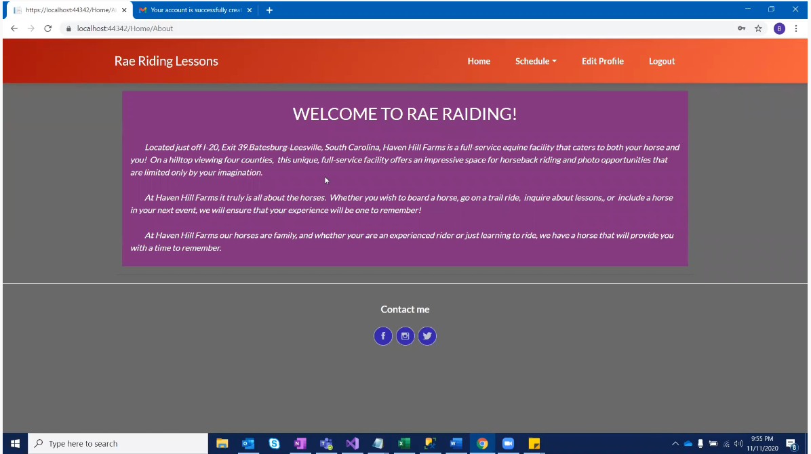
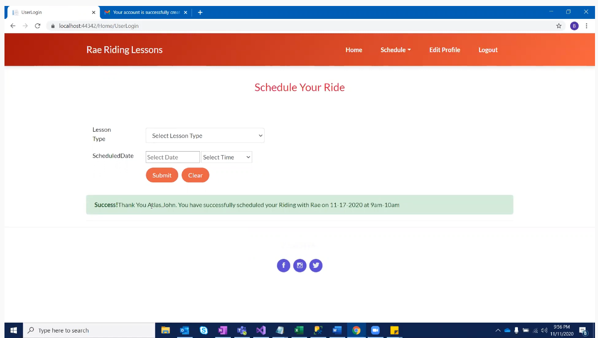
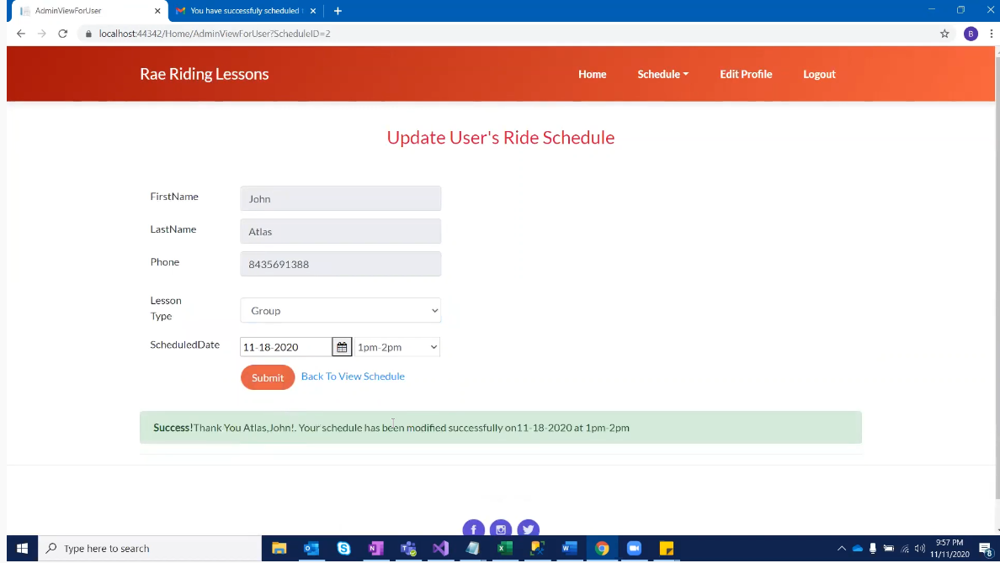

[Back to Portfolio](./)

Role Playing Game
===============

-   **Class: CSCI 325** 
-   **Grade: 100**
-   **Language(s): Java, JavaFX**
-   **Source Code Repository:** [yeungs2019RPG](https://github.com/Epowell50/CSCI-495-Team-Project)  
    (Please [email me](mailto:sayeung@csustudent.net?subject=GitHub%20Access) to request access.)

## Project description
This project was required for the completion of CSCI 325.  It was a very large project that required the assistance of three people. Each person was assigned to a portion of the program.  I was assigned to design and implement the items in the game.  There are a total of three items, which one of the healed, and the other two hurt.  There were puzzles, which were the main portion of the project.  Each time a puzzle was completed, the player is granted 25 points. Once a player reached 100 points, the game is over and the player has won.

## How to compile / run the program

How to compile (if applicable) and run the project.

```bash
Step 1: Install NetBeans IDE version 8.1 or later 
Step 2: Download all files from github repository and place in a singular folder 
Step 3: Launch NetBeans IDE and select the project that needs to be ran
Step 4: Open project and the classes that are available.
Step 5: Click Run
```

## UI Design
The UI Design on this project was heavily emphasized because it ran on JavaFX, which is graphical user interface that was clickable. When the user first enters the game, they will prompted to click the start button (See Fig 1).  Once they have started, they will be asked to enter their name (See Fig 2).  After they have entered their name, they will be prompted to select a character they want to play with (See Fig 3). Once they have selected their character, they are to traverse through the board


Fig 1. The first page that will be seen when the program is first run


Fig 2. The page when user clicks signup


Fig 3 After sign up is successful, the user will be asked to confirm.


Fig 4. The login page


Fig 5. After login is successful, the user is greeted with message


Fig 6. The user scheduling his/her appointment


Fig 7. The user's ability to reschedule


Fig 8. The user's ability to change personal information

## 3. Additional Considerations
This project gave a view of what it is actually like in the real workplace.  Deadlines had to be made.  Communication was a key factor for success. It was an extensive team project that took time to develop.  Credit to those involved in the large team project.

For more details see [GitHub Flavored Markdown](https://guides.github.com/features/mastering-markdown/).

[Back to Portfolio](./)
