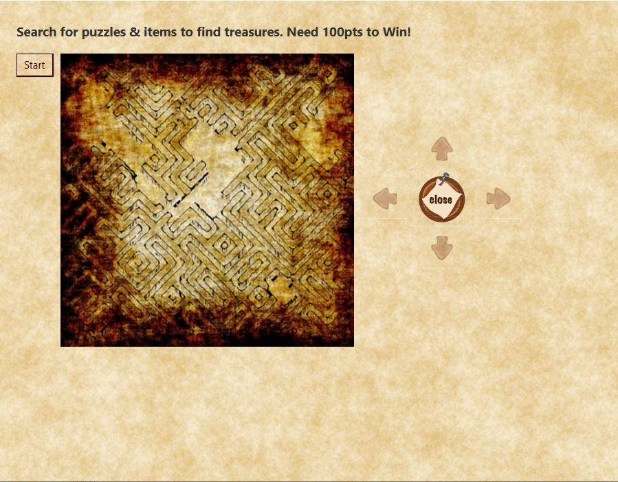

[Back to Portfolio](./)

Role Playing Game
===============

-   **Class: CSCI 325** 
-   **Grade: 100**
-   **Language(s): Java, JavaFX**
-   **Source Code Repository:** [yeungs2019RPG](https://github.com/csu-cs/RPG-team-project)  
    (Please [email me](mailto:sayeung@csustudent.net?subject=GitHub%20Access) to request access.)

## Project description
This project was required for the completion of CSCI 325.  It was a very large project that required the assistance of three people. Each person was assigned to a portion of the program.  I was assigned to design and implement the items in the game.  There are a total of three items, which one of the healed, and the other two hurt.  There were puzzles, which were the main portion of the project.  Each time a puzzle was completed, the player is granted 25 points. Once a player reached 100 points, the game is over and the player has won.

## How to compile / run the program

How to compile (if applicable) and run the project.

```bash
Step 1: Install NetBeans IDE version 8.1 or later 
Step 2: Download all files from github repository and place in a singular folder 
Step 3: Launch NetBeans IDE and select the project that needs to be ran
Step 4: Open project and the classes that are available.
Step 5: Click Run
```

## UI Design
The UI Design on this project was heavily emphasized because it ran on JavaFX, which is graphical user interface that was clickable. When the user first enters the game, they will prompted to click the start button (See Fig 1).  Once they have started, they will be asked to enter their name (See Fig 2).  After they have entered their name, they will be prompted to select a character they want to play with (See Fig 3). Once they have selected their character, they are to traverse through the board.  A fully traversed board is shown in Fig 4.  If a player lands a puzzle, they are prompted with a puzzle that will grant them twenty-five points if solved correctly (See Fig 5).  They can choose to solve it or leave it for later.  If a player lands on an item, they are prompted with an item that will either help them or hurt them. The items include a twenty-five point gain (See Fig 6), twenty-five point loss (See Fig 7), and undo a puzzle (See Fig 8).  The undo a puzzle potion has the function of undoing a solved puzzle.  For example, if there was a puzzle that was solved, and the player accepts this item, the most recent puzzle will return to its original state and can never be solved again for the duration of the game.  Once the player has reached 100 points, the game ends and a winner's banner will be deployed (See Fig 9).


Fig 1. The first page that will be seen when the program is first run


Fig 2. The dialog box when the player begins the game


Fig 3. After player has entered their name, they are to select a character to play with.


Fig 4. The board that reveals all of the puzzles and items


Fig 5. When a player steps on treasure chest, a puzzle like this will pop up.


Fig 6. This potion will grant 25 bonus points


Fig 7. This potion will deduct 25 points


Fig 8. This potion will reverse your progess and score


Fig 9. Once the game is completed, this box will pop up and signaling to the user that the game is over because they won and can exit.

## 3. Additional Considerations
This project gave a view of what it is actually like in the real workplace.  Deadlines had to be made.  Communication was a key factor for success. It was also a learning experience in knowing how to operate in team programming situations. Credit to those involved in the large team project.

For more details see [GitHub Flavored Markdown](https://guides.github.com/features/mastering-markdown/).

[Back to Portfolio](./)
