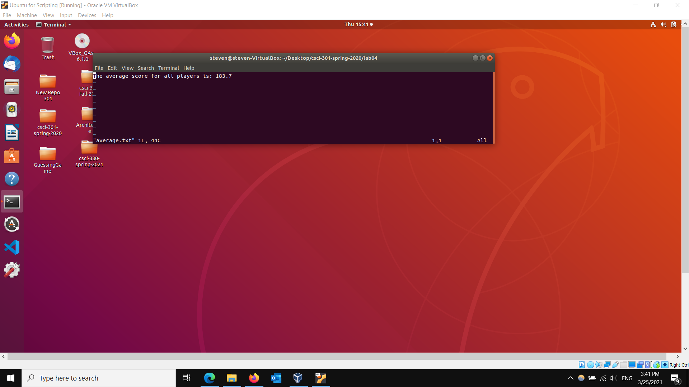
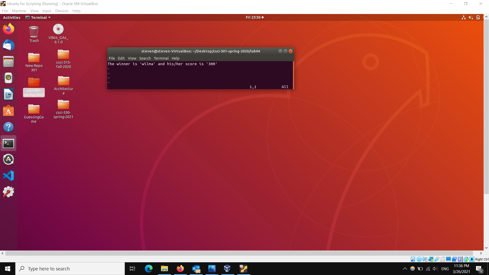

[Back to Portfolio](./)

Perl Hash Table
===============

-   **Class: CSCI 301** 
-   **Grade: 100**
-   **Language(s): Perl**
-   **Source Code Repository:** [yeungs2019Perl](https://github.com/yeungs2019/csci-301-spring-2020/tree/master/lab04)  
    (Please [email me](mailto:sayeung@csustudent.net?subject=GitHub%20Access) to request access.)

## Project description
This lab was designed to test the knowledge of reading in text files and performing calculations like sorting, averaging, and finding largest value. and write out to text files using a Hash Table in Perl. The program used a hash table to accomplish the calculations. The program first reads a .txt file given, depending on the operation given, it will produce another .txt file with data that had been sorted, averaged, or found largest value.    

## How to compile / run the program

How to compile (if applicable) and run the project.

```bash
cd lab04
./lab04.pl
```

## UI Design
There is no UI design for this project as it was an excercise to enhance Perl knowledge and the hash table knowledge.  The .txt file that was fed through was an unsorted list (See Fig 1).  The first operation is sorting using a hash table as seen in Fig 2.  The second operation is finding the average of the scores of the people in the .txt file (See Fig 3).  The third operation is finding the largest value.  With this, the operation uses logic to find the largest number in the text file after it has been sorted and display the person who got the score, their score, and their congratualation statement (See Fig 4).  


Fig 1. The unsorted list


Fig 2. The sorted list


Fig 3. The average of the scores


Fig 4. The largest value and the winner

## 3. Additional Considerations
This project was an excercise using a programming language decreasing in popularity.  Reading and writing to text file was one of the main aspects of the program, alongside performing operations that modified text files.

For more details see [GitHub Flavored Markdown](https://guides.github.com/features/mastering-markdown/).

[Back to Portfolio](./)

